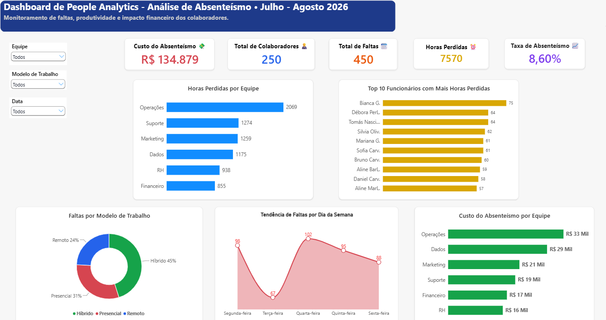
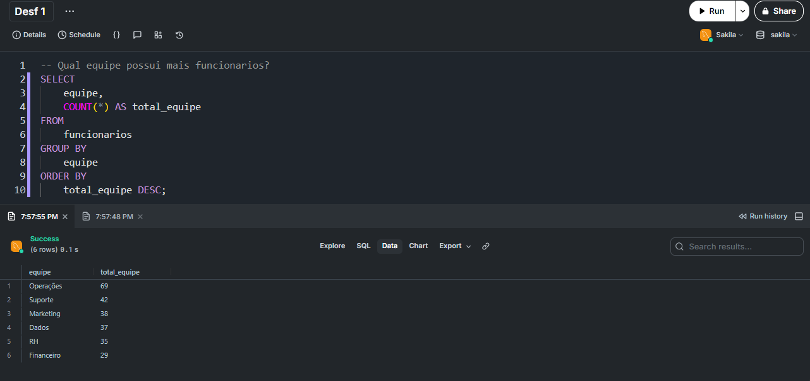
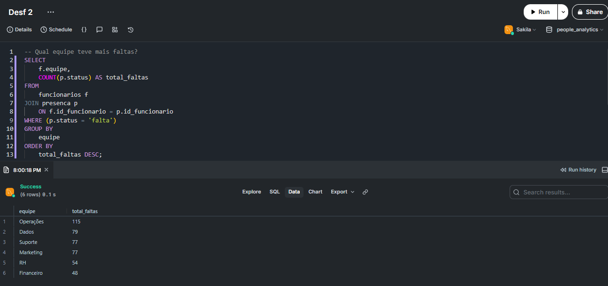
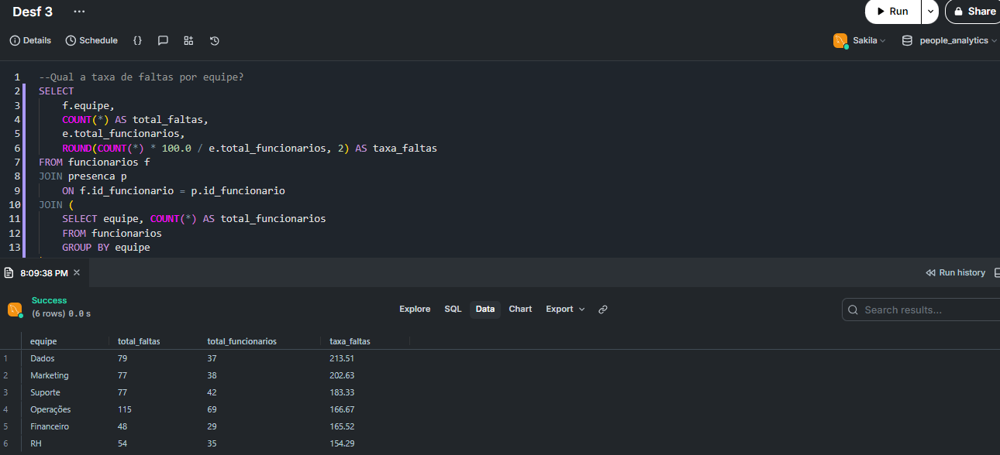
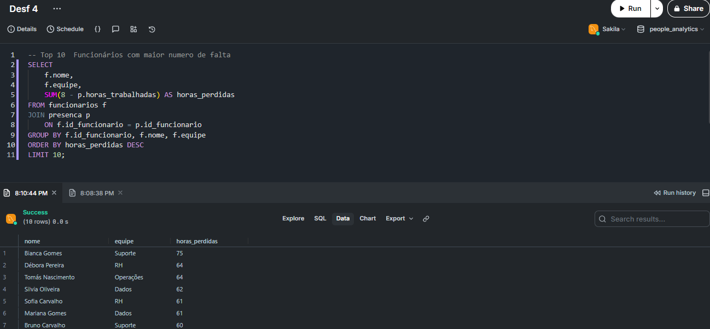
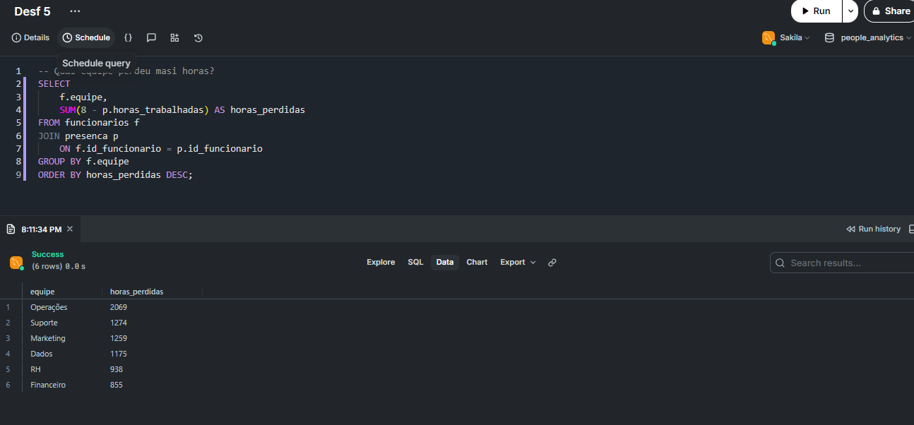

# 📊 Dashboard de People Analytics - Análise de Absenteísmo

Projeto de Business Intelligence criado para praticar **SQL, MySQL, Power BI e DAX** em um cenário de **People Analytics**.

O projeto simula uma empresa fictícia chamada **TechNordeste Distribuidora**, uma distribuidora de tecnologia que possui **250 colaboradores** divididos entre as equipes de Operações, Dados, Marketing, RH, Financeiro e Suporte.

O desafio foi analisar os registros de presença dos colaboradores para entender **onde o absenteísmo gera maior impacto**, quais equipes concentram mais faltas, quantas horas de trabalho foram perdidas e qual o custo estimado desse problema para a empresa.

## 🏢 Contexto da empresa fictícia

**Empresa:** TechNordeste Distribuidora

**Segmento:** Distribuição de produtos de tecnologia e eletrônicos.

**Quantidade de colaboradores:** 250 funcionários.

**Período analisado:** Julho de 2026.

Neste cenário, a área de RH precisa acompanhar indicadores de absenteísmo para apoiar decisões sobre produtividade, equipes com maior impacto e custos relacionados às faltas dos colaboradores.

## 🚀 Tecnologias utilizadas

* Power BI.
* MySQL para modelagem e criação do banco de dados.
* SQL para realizar consultas, acho o desigh mais intuitivo que o Workberch.
* ChatGPT para geração do dataset fictício utilizado no projeto.

---

## 🖥️ Dashboard de People Analytics

O dashboard reúne os principais indicadores de absenteísmo da empresa em uma única visão, permitindo acompanhar custos, horas perdidas, equipes mais impactadas e padrões de faltas.

## 💡 Principais insights da análise

A partir das consultas SQL e do dashboard no Power BI, foi possível identificar alguns padrões de absenteísmo durante o período analisado.

### 📍 Operações concentrou o maior impacto no absenteísmo

* É a maior equipe da empresa, com **69 colaboradores**.
* Também registrou o maior número de faltas (**115**).
* Acumulou **2.069 horas perdidas**, o maior valor entre todas as equipes.
* O custo estimado do absenteísmo da equipe foi de aproximadamente **R$ 33 mil**.

**Insight:** Operações merece maior atenção, pois concentra o maior impacto financeiro e operacional.

---

### 📍 Dados apresentou a maior taxa de faltas

Mesmo não sendo a maior equipe, Dados teve a maior taxa de faltas da análise.

* **79 faltas registradas.**
* **37 colaboradores.**
* **Maior taxa de faltas entre todas as equipes.**

**Insight:** A equipe de Dados possui um absenteísmo proporcionalmente maior que as demais equipes.

---

### 📍 O custo do absenteísmo ultrapassou R$ 134 mil

O projeto estimou o impacto financeiro das horas não trabalhadas considerando o salário médio dos colaboradores.

* **R$ 134.879** de custo estimado.
* **7.570 horas** de trabalho perdidas.

**Insight:** O absenteísmo gera um impacto financeiro relevante e pode afetar produtividade e custos da empresa.

---

### 📍 O modelo híbrido concentrou a maior parte das faltas

A análise por modelo de trabalho mostrou uma distribuição diferente entre as modalidades.

* 🟢 Híbrido: **45%**
* 🔵 Presencial: **31%**
* 🟣 Remoto: **24%**

**Insight:** Colaboradores em modelo híbrido concentraram a maior participação nas faltas registradas.

---

### 📍 Alguns colaboradores concentraram muitas horas perdidas

O ranking dos colaboradores mostrou quem acumulou mais horas não trabalhadas.

| Colaborador      | Horas perdidas |
| :--------------- | -------------: |
| Bianca Gomes     |       **75 h** |
| Débora Pereira   |       **64 h** |
| Tomás Nascimento |       **64 h** |

**Insight:** O ranking ajuda a identificar colaboradores que podem precisar de acompanhamento mais próximo.

---

### 📍 Visão geral do período analisado

| Indicador                   |      Resultado |
| :-------------------------- | -------------: |
| 👥 Colaboradores analisados |        **250** |
| ❌ Total de faltas           |        **450** |
| ⏱️ Horas perdidas           |      **7.570** |
| 💸 Custo do absenteísmo     | **R$ 134.879** |
| 📊 Taxa de absenteísmo      |      **8,60%** |

**Resumo:** O dashboard mostra onde o absenteísmo teve maior impacto, quais equipes foram mais afetadas e qual foi o custo estimado para a empresa durante o período analisado.

---

## 📌 Perguntas respondidas com SQL

### 1. Qual equipe possui mais funcionários?
A consulta conta quantos colaboradores existem em cada equipe.

**O que descobri**
- Operações é a maior equipe da empresa (69 colaboradores).
- Financeiro é a menor equipe (29 colaboradores).

---

### 2. Qual equipe teve mais faltas?
A consulta soma todos os registros de falta por equipe.

**O que descobri**
- Operações teve o maior número de faltas (115).
- Financeiro ficou com o menor número de faltas (48).

---

### 3. Qual a taxa de faltas por equipe?
A consulta calcula a proporção de faltas em relação ao total de colaboradores de cada equipe.

**O que descobri**
- Dados apresentou a maior taxa de faltas (213,51%).
- Operações teve muitas faltas em números absolutos, mas por ter mais colaboradores, sua taxa relativa é menor (166,67%).

---

### 4. Quais colaboradores perderam mais horas?
A consulta cria um ranking dos 10 colaboradores com mais horas perdidas.

**O que descobri**
- Bianca Gomes liderou o ranking, com 75 horas perdidas.
- O Top 10 mostra quem teve maior impacto individual nas horas perdidas.

---

### 5. Qual equipe perdeu mais horas de trabalho?
A consulta soma todas as horas perdidas por equipe.

**O que descobri**
- Operações perdeu mais horas de trabalho (2.069 horas).
- Financeiro foi a equipe que menos perdeu horas (855 horas).

---

## 📈 Principais resultados da análise
- 250 colaboradores analisados.
- 450 faltas registradas.
- 7.570 horas perdidas.
- R$ 134.879 de custo estimado do absenteísmo.
- 8,60% de taxa de absenteísmo.

